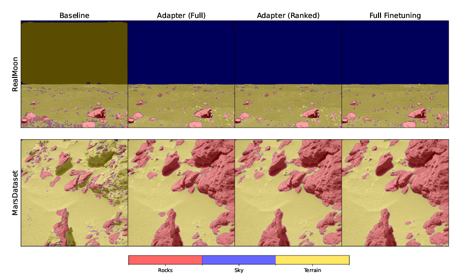

# Efficient Adaptation of Deep Neural Networks for Semantic Segmentation in Space Applications
In recent years, the application of Deep Learning techniques has shown remarkable success in various computer vision tasks, paving the way for their deployment in extraterrestrial exploration. Transfer learning has emerged as a powerful strategy for addressing the scarcity of labeled data in these novel environments. This paper represents one of the first efforts in evaluating the feasibility of employing adapters toward efficient transfer learning for rock segmentation in extraterrestrial landscapes, mainly focusing on lunar and martian terrains. Our work suggests that the use of adapters, strategically integrated into a pre-trained backbone model, can be successful in reducing both bandwidth and memory requirements for the target extraterrestrial device. In this study, we considered two memory-saving strategies: layer fusion (to reduce to zero the inference overhead) and an “adapter ranking” (to also reduce the transmission cost). Finally, we evaluate these results in terms of task performance, memory, and computation on embedded devices, evidencing trade-offs that open the road to more research in the field.



Please cite our paper if you use it in your research：

```
@article{olivi2025efficient,
  title={Efficient adaptation of deep neural networks for semantic segmentation in space applications},
  author={Olivi, Leonardo and Santero Mormile, Edoardo and Tartaglione, Enzo},
  journal={Scientific Reports},
  volume={15},
  number={1},
  pages={1--14},
  year={2025},
  publisher={Nature Publishing Group}
}
```

# Environment Setup

## Linux 
```bash
# Create a virtual environment
python -m venv myenv

# Activate the environment
source myenv/bin/activate

# Install packages
pip install -r requirements.txt
```

## Windows
```cmd
# Create a virtual environment
python -m venv myenv

# Activate the environment
myenv\Scripts\activate.bat

# Install packages
pip install -r requirements.txt
```

# Datasets Setup

## Synthetic & Real Moon Dataset
  1) The synthetic and real moon dataset created by Romain Pessia (https://doi.org/10.34740/kaggle/dsv/489236) can be downloaded using this Kaggle link: https://www.kaggle.com/datasets/romainpessia/artificial-lunar-rocky-landscape-dataset
  2) The dataset folder must to be renamed to "**synthetic-moon-dataset**"

## AI4Mars
  1) The AI4Mars dataset, can be downloaded at the following link and saved as "**ai4mars-dataset-merged-0.1**": https://data.nasa.gov/dataset/ai4mars-a-dataset-for-terrain-aware-autonomous-driving-on-mars
  2) The script "**remove_rover_ai4mars.py**" must be executed to delete rover images from the dataset
 
## MarsDatasetv2 + Sky Annotations
  1) The MarsDatasetv2 can be downloaded at the following link: https://github.com/CVIR-Lab/MarsData
  2) The dataset folder must be renamed to "**MarsDataset-v3**"
  3) The **sky-annotations** folder must be downloaded from this git repository and moved to the dataset directory


# Code Description
- **unet_custom.py**: contains all classes definitions for custom U-Nets developed in our work. It also contains functions to compress, transfer weights and rank adapters
- **model_library.py**: contains all main functions needed to run training, evaluation and default plotting. It also contains classes definition for the datasets.
- **model_library_classic.py**: contains functions of model_library customized for classic algorithms (e.g. otsu, canny and hybrid)
- **model_train.py**: contains functions to train deep learning models using synthetic-moon-dataset. It can be run with wandb (use sweep_config.yaml) or locally.
- **model_test.py**: contains functions to test and plot results of trained deep learning models 
- **model_test_classic.py**: contains functions to test classic algorithms
- **model_test_extdevice.py**: evaluates performance of the deep learning model using external devices (e.g. jetson nano and raspberry pi)
- **adapters_flops_params.py**: evaluates flops and number of trained params for fine-tuning methods and adapters
- **baseline_flops_params.py**: evaluates flops and number of trained params for baseline methods
- **fusemethod_flops_params.py**: evaluates flops and number of trained params for adapter-fusing methods
- **adapters_pareto.py**: plots pareto curves for adapters and traditional fine-tuning methods
- **model_storage.py**: evaluates storage memory of deep learning models
- **plot_layer_ablation.py**: plots results for layer-by-layer ablation study
- **plotpreds.py**: plots predictions for different datasets (MarsDatasetv3 and Real-Moon)
- pvalue.py: evaluates p-value for Shapiro-Wilk and Wilcoxon signed-rank test
